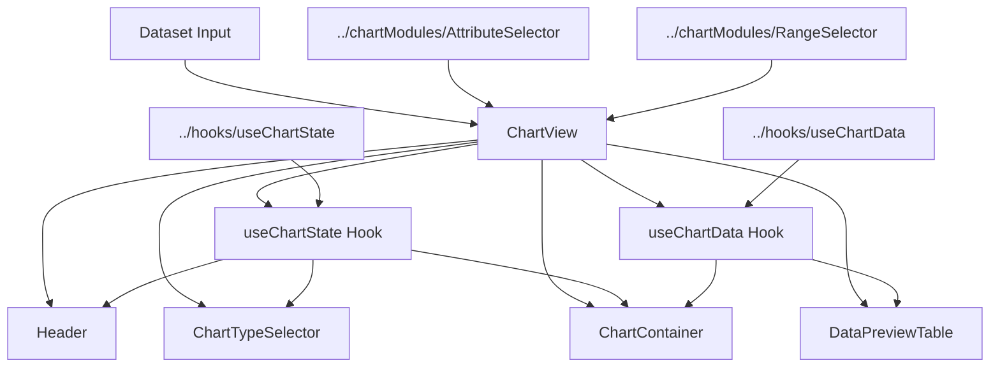
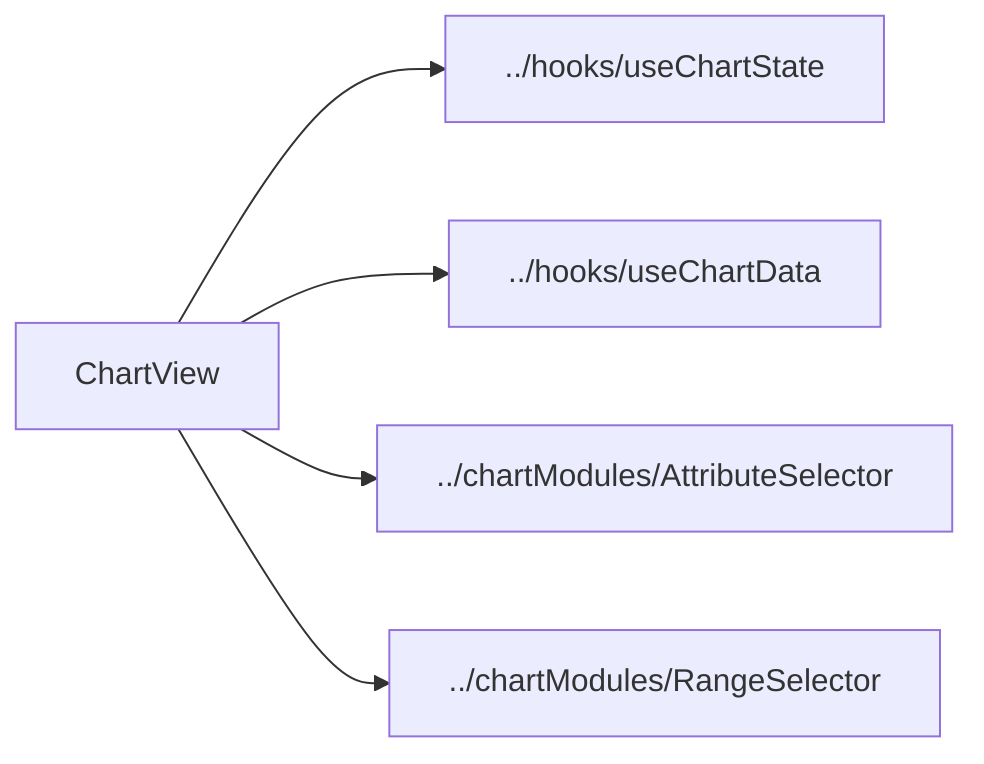
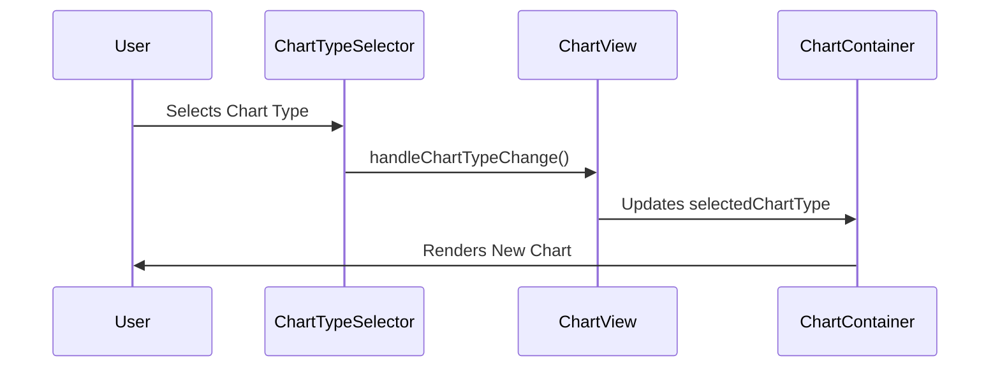
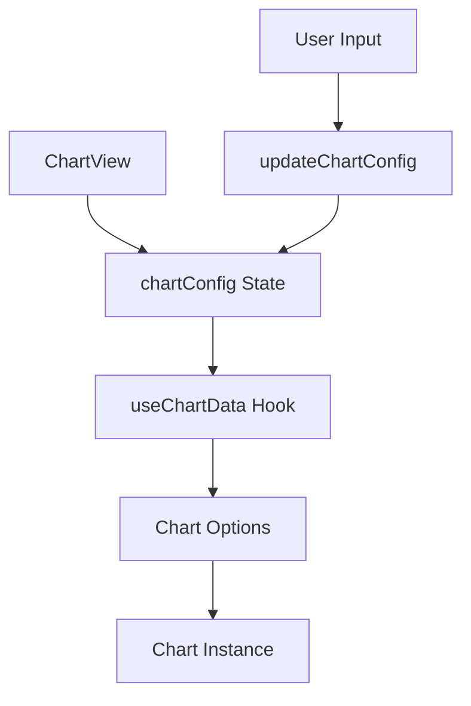
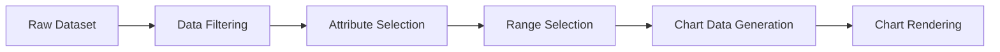

# ChartView Component Documentation

## 📊 Overview

The ChartView component is a sophisticated data visualization system that transforms raw data into interactive charts. It's built with React, TypeScript, and Chart.js, providing a modular and extensible architecture for data visualization.

## 🔄 Data Flow and Component Relationships



## 📁 File Structure and Responsibilities

### 1. `ChartView.tsx` (Main Component)

**Primary Functions:**

- Orchestrates the overall chart visualization system
- Manages component state and data flow
- Handles chart type selection and attribute filtering
- Coordinates between child components

**External Dependencies:**



### 2. `ChartContainer.tsx`

**Primary Functions:**

- Renders different chart types (Line, Bar, Pie, etc.)
- Handles chart responsiveness
- Manages zoom and pan interactions
- Displays chart loading states and error messages

**Code Example:**

```typescript
const renderChart = (chartType: ChartConfig["type"], data: any) => {
  const commonProps = {
    ref: chartRef,
    data,
    options: chartOptions,
    className: "chart-container",
  };
  switch (chartType) {
    case "line":
      return <Line {...commonProps} />;
    case "bar":
      return <Bar {...commonProps} />;
    // ... other chart types
  }
};
```

### 3. `ChartTypeSelector.tsx`

**Primary Functions:**

- Displays available chart types
- Handles chart type selection
- Shows compatibility information
- Provides chart type descriptions

**Data Flow:**



### 4. `Header.tsx`

**Primary Functions:**

- Controls chart settings and options
- Manages fullscreen mode
- Handles chart and data export
- Provides attribute selection toggle

### 5. `DataPreviewTable.tsx`

**Primary Functions:**

- Displays filtered dataset preview
- Shows selected attributes
- Formats data values
- Handles pagination

## 🔧 Configuration and Integration

### Chart Configuration Flow



### Data Processing Pipeline



## 🔌 Integration with External Components

### 1. Hook Integration

- `useChartState`: Manages chart-specific state and configuration
- `useChartData`: Handles data processing and chart data generation

### 2. Module Dependencies

- `chartModules/AttributeSelector`: Controls attribute selection
- `chartModules/RangeSelector`: Manages data range selection
- `utils/chartDataUtils`: Provides chart data processing utilities
- `utils/chartOptions`: Configures chart appearance and behavior

## 🎨 Styling and Theming

The components use a combination of:

- Tailwind CSS for utility classes
- CSS Modules for component-specific styles
- Dynamic styling based on chart type and state

## 🚀 Performance Optimizations

1. **Data Processing:**

   - Memoization of chart data calculations
   - Throttled range selection updates
   - Efficient data filtering algorithms

2. **Rendering:**
   - Conditional rendering of components
   - Chart.js optimization settings
   - Lazy loading of chart types

## 📈 Example Usage

```tsx
// Basic usage
<ChartView
  dataset={myDataset}
  initialChartType="line"
  showAllCharts={false}
  onChartSelect={(chartType) => console.log(`Selected: ${chartType}`)}
/>

// With all charts view
<ChartView
  dataset={myDataset}
  showAllCharts={true}
/>
```

## 🔍 Debugging Tips

1. Chart Rendering Issues:

   - Check chart data format
   - Verify attribute selection
   - Inspect chart options

2. Performance Issues:
   - Monitor data size
   - Check memoization effectiveness
   - Review render cycles

## 🤝 Contributing Guidelines

1. Follow the established component structure
2. Maintain type safety
3. Add necessary documentation
4. Include unit tests
5. Optimize for performance

## 📝 Type Definitions

Key types from `types.ts`:

```typescript
interface ChartViewProps {
  dataset: Dataset;
  initialChartType?: ChartConfig["type"];
  showAllCharts?: boolean;
  onChartSelect?: (chartType: ChartConfig["type"]) => void;
}
```
