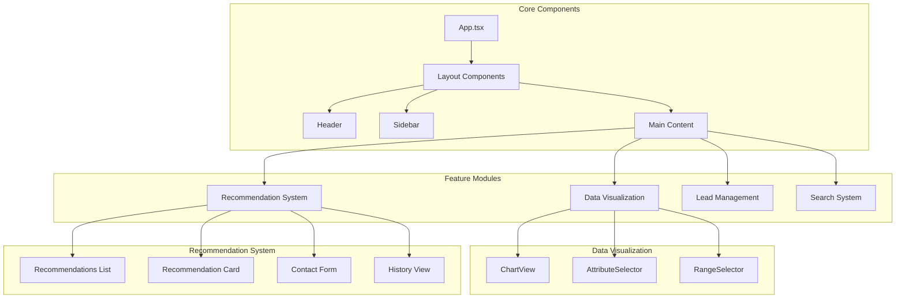
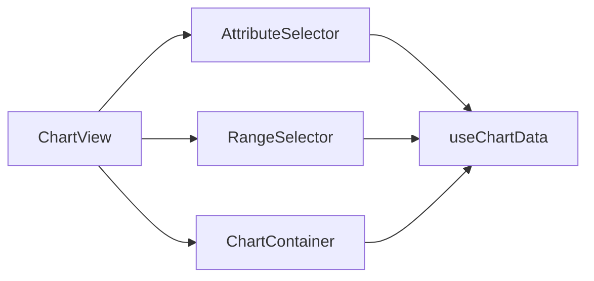
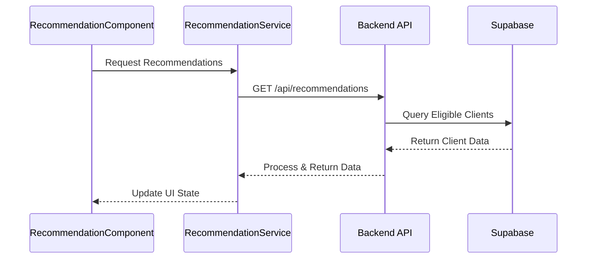
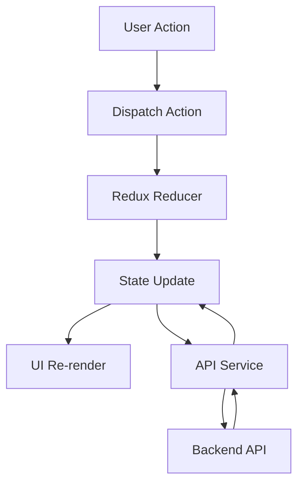

# Data Visualizer Pro - Components Documentation

## 📊 Project Summary

Data Visualizer Pro is a sophisticated data analysis and visualization platform with integrated AI-powered recommendations. The components directory houses the core building blocks of the application's user interface and business logic.

## 🏗 Component Architecture



## 🔧 Important Modules & Functions

### 1. Data Visualization Components



**Key Features:**
- Dynamic chart type selection
- Attribute filtering and mapping
- Range-based data filtering
- Real-time updates
- Export capabilities

### 2. Recommendation System



**Key Components:**
- Recommendations.tsx: Main recommendation view
- LoanApplicantCard.tsx: Individual recommendation display
- ContactForm.tsx: Lead capture form
- RecommendationTable.tsx: Historical view

## 🚀 Setup Instructions

1. **Install Dependencies**
```bash
cd frontend
npm install
```

2. **Environment Configuration**
```bash
# .env
VITE_SUPABASE_URL=your_supabase_url
VITE_SUPABASE_KEY=your_anon_key
VITE_CORE_API=http://localhost:3001
VITE_REC_API=http://localhost:3002
```

3. **Start Development Server**
```bash
npm run dev
```

## 📍 Component File Structure

```
components/
├── ChartView/
│   ├── ChartView.tsx         # Main chart component
│   ├── ChartContainer.tsx    # Chart rendering
│   └── README.md            # Chart documentation
├── recommendations/
│   ├── Recommendations.tsx   # Main recommendation component
│   ├── LoanApplicantCard.tsx # Individual recommendation
│   ├── ContactForm.tsx       # Lead form
│   └── README.md            # Recommendation docs
├── Leadtracking/
│   ├── LeadTable.tsx        # Lead management
│   └── LeadStats.tsx        # Lead analytics
├── Search/
│   └── SearchCustomer.tsx   # Customer search
└── shared/
    ├── Header.tsx           # App header
    ├── Sidebar.tsx          # Navigation
    └── utils/               # Shared utilities
```

## 🔄 State Management

### Redux Store Structure
```typescript
interface RootState {
  ui: {
    showContactForm: boolean;
    showFilters: boolean;
  };
  leads: {
    items: Lead[];
    hasClicked: boolean;
  };
  recommendations: {
    items: Recommendation[];
    loading: boolean;
  };
}
```

### Data Flow


## 📊 Component Integration

### 1. Chart Integration
```typescript
interface ChartProps {
  data: Dataset;
  type: ChartType;
  options: ChartOptions;
}
```

### 2. Recommendation Integration
```typescript
interface RecommendationProps {
  applicant: RecommendationData;
  onContact: (id: number) => void;
}
```

## 🛠 Development Tools

1. **VS Code Extensions**
   - ESLint
   - Prettier
   - TypeScript
   - Tailwind CSS IntelliSense

2. **Browser Tools**
   - React DevTools
   - Redux DevTools
   - Chrome DevTools

## 🔐 Security Considerations

1. **Input Validation**
   - Form data validation
   - Type checking
   - XSS prevention

2. **Authentication**
   - Protected routes
   - Token management
   - Session handling

## 🎨 Styling Guidelines

1. **Tailwind CSS Classes**
   - Utility-first approach
   - Component-specific styles
   - Responsive design patterns

2. **Theme Configuration**
   - Color schemes
   - Typography
   - Spacing system

## 🚀 Performance Optimization

1. **React Optimization**
   - Memoization
   - Code splitting
   - Lazy loading
   - Virtual scrolling

2. **Data Management**
   - Caching strategies
   - Pagination
   - Debouncing/Throttling
