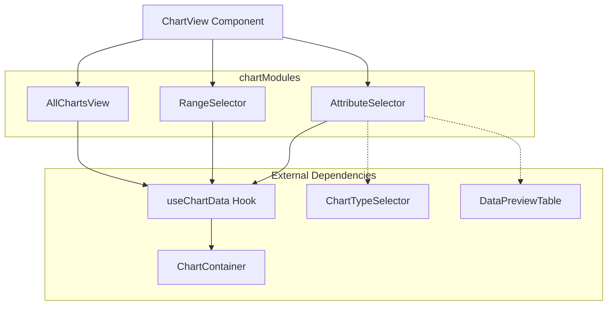
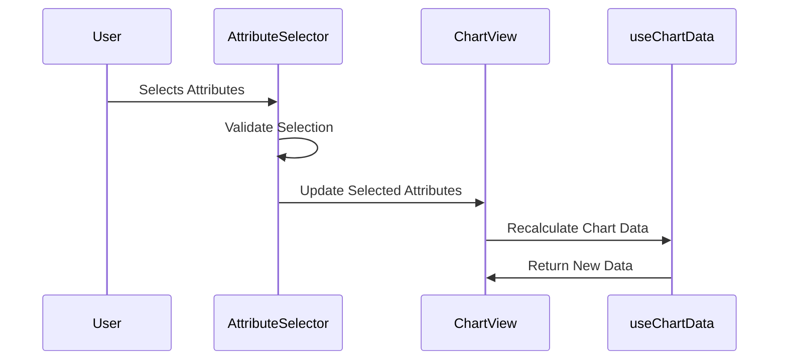
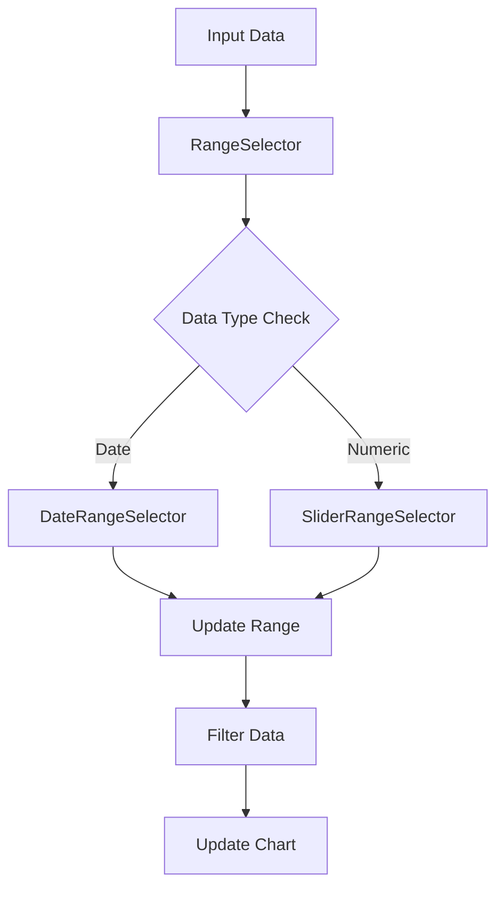
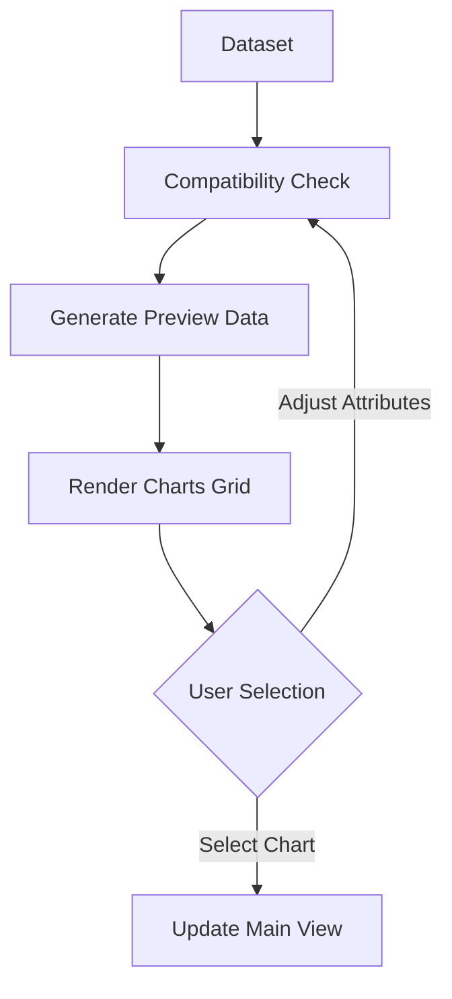
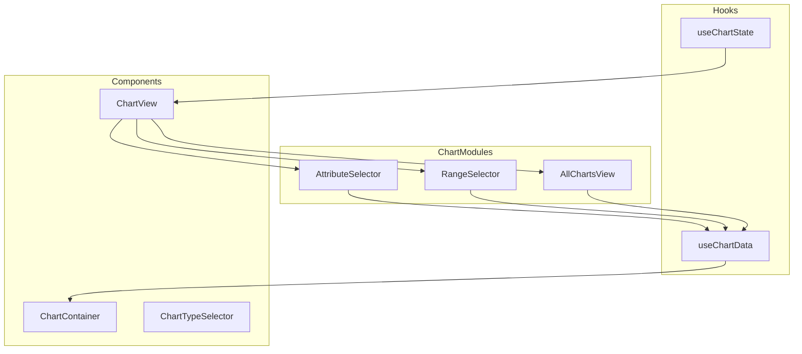

# Chart Modules Documentation

## 📊 Overview

The chartModules folder contains essential components for data visualization and chart manipulation. These modules work together to provide attribute selection, range filtering, and comprehensive chart viewing capabilities.

## 🔄 Module Relationships



## 📁 Module Details

### 1. AttributeSelector (`AttributeSelector.tsx`)

**Purpose:** Handles attribute selection and data type detection for visualization.

**Key Features:**

- Automatic data type detection (number/string/date)
- Multiple attribute selection
- Attribute compatibility checking
- Sample value preview
- Statistical information display

**Data Flow:**



**Code Interactions:**

```typescript
interface AttributeInfo {
  name: string;
  type: "number" | "string" | "date";
  selected: boolean;
  sampleValues: any[];
  uniqueCount: number;
  nullCount: number;
}

// Interacts with outside files:
// - ../ChartView/ChartView.tsx
// - ../hooks/useChartData.ts
// - ../constants/ChartConstants.tsx
```

### 2. RangeSelector (`RangeSelector.tsx`)

**Purpose:** Provides data range filtering capabilities for charts.

**Key Features:**

- Numeric range selection
- Date range selection with calendar
- Real-time data filtering
- Custom date formatting
- Responsive slider interface

**Component Flow:**



### 3. AllChartsView (`AllChartsViews.tsx`)

**Purpose:** Displays multiple chart types simultaneously for data comparison.

**Key Features:**

- Grid layout of compatible charts
- Chart type previews
- Quick chart selection
- Responsive design
- Chart compatibility filtering

**Data Processing Flow:**



## 🔧 Integration with External Components

### Data Flow Architecture



## 📊 Data Manipulation Process

1. **Attribute Selection Stage:**

   - Data type detection
   - Compatibility validation
   - Selection limits enforcement
   - Statistical calculation

2. **Range Selection Stage:**

   - Data range determination
   - Date parsing and validation
   - Range bounds calculation
   - Data filtering

3. **Chart Generation Stage:**
   - Data format transformation
   - Chart compatibility check
   - Preview data generation
   - Chart options configuration

## 🛠 Common Utilities

### Date Handling

```typescript
// Date parsing utility used across modules
const parseDDMMYYYY = (dateString: string): Date => {
  const parts = dateString.split(/[\/\-\.]/);
  return new Date(Number(parts[2]), Number(parts[1]) - 1, Number(parts[0]));
};
```

### Data Type Detection

```typescript
// Shared data type detection logic
const detectDataType = (values: any[]): "number" | "string" | "date" => {
  // Implementation details...
};
```

## 🔄 State Management

- Uses React's useState and useCallback for local state
- Implements memoization for performance optimization
- Maintains synchronization with parent components
- Handles complex state dependencies

## 🎨 Styling Integration

- Uses Tailwind CSS for styling
- Implements responsive design patterns
- Maintains consistent theme across components
- Provides smooth transitions and animations

## 🚀 Performance Considerations

1. **Data Processing:**

   - Implements data chunking for large datasets
   - Uses memoization for expensive calculations
   - Optimizes re-renders with useMemo

2. **UI Responsiveness:**
   - Implements throttling for range updates
   - Uses virtual scrolling for large lists
   - Optimizes chart rendering cycles

## 📝 Error Handling

- Validates input data types
- Provides fallback values
- Shows user-friendly error messages
- Maintains chart stability during errors

## 🔗 External Dependencies

- Chart.js for chart rendering
- Day.js for date manipulation
- Tailwind CSS for styling
- React-Select for dropdowns
