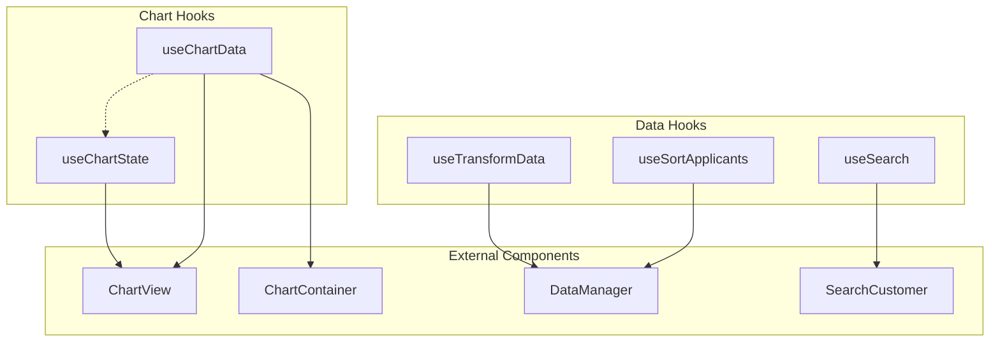
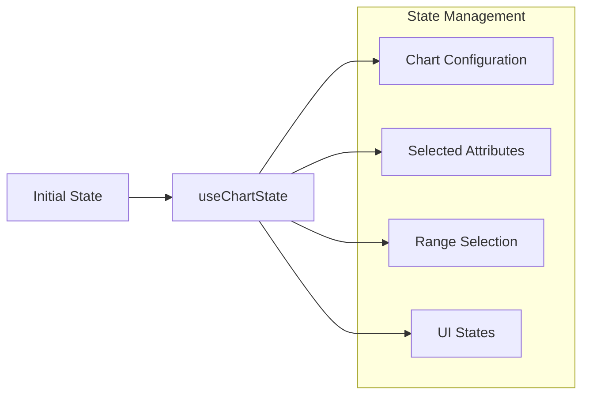
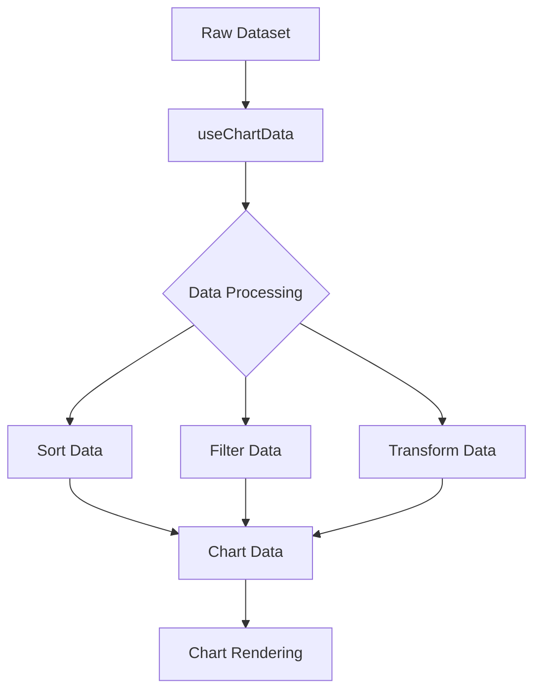
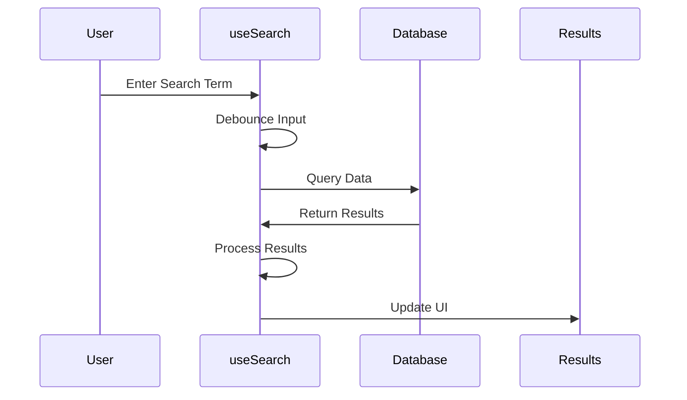
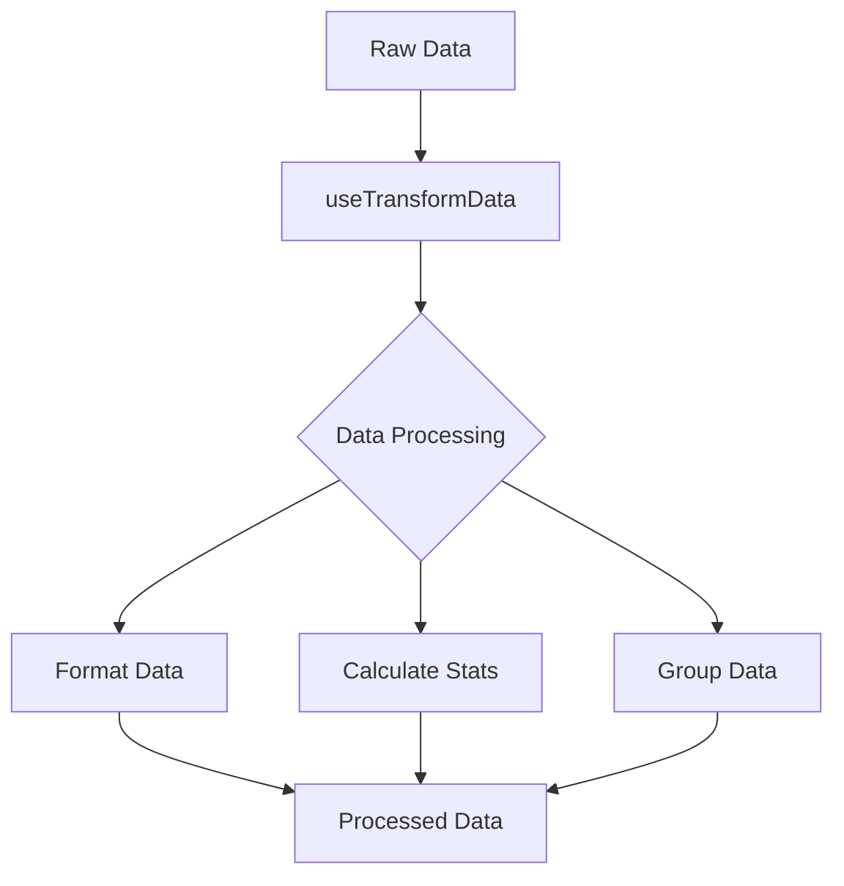
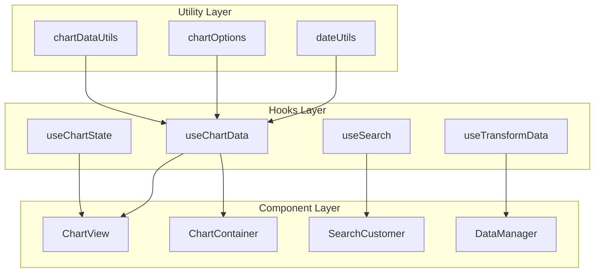
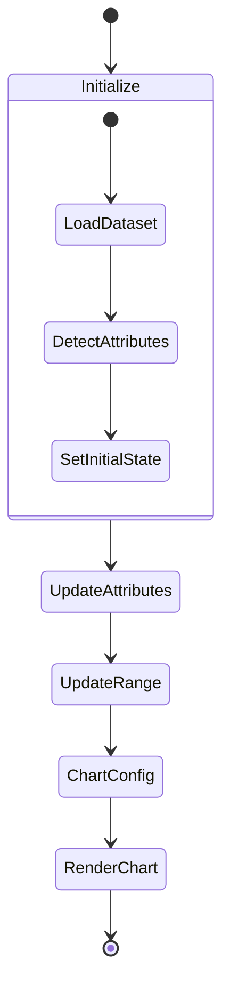

# Custom Hooks Documentation

## 📊 Overview

The hooks folder contains custom React hooks that manage complex state logic, data processing, and chart-related functionality for the dashboard application.

## 🔄 Hook Relationships



## 📁 Hook Details

### 1. `useChartState`

**Purpose:** Manages the core chart state and configuration.



**Key Features:**

- Chart type selection
- Attribute management
- Range selection
- Fullscreen handling
- Settings management
- Zoom controls

**Code Example:**

```typescript
const {
  selectedChartType,
  selectedAttributes,
  selectedRange,
  chartConfig,
  // ... other states
} = useChartState(dataset, initialChartType);
```

### 2. `useChartData`

**Purpose:** Handles data processing and chart data generation.



**Key Features:**

- Data sorting and filtering
- Chart data generation
- Range calculation
- Data type detection
- Chart compatibility checking

**Integration Example:**

```typescript
const { chartData, compatibleChartTypes, rangeLabels, chartOptions } =
  useChartData(
    dataset,
    selectedChartType,
    selectedAttributes,
    selectedRange,
    setSelectedRange,
    chartConfig,
    isFullscreen,
    attributeTypes
  );
```

### 3. `useSearch`

**Purpose:** Provides search functionality for customer data.



**Features:**

- Debounced search
- Result filtering
- Search history
- Error handling

### 4. `useTransformData`

**Purpose:** Transforms and processes data for visualization.



## 🔧 Integration with Components

### Data Flow Architecture



## 📊 Data Manipulation Processes

### 1. Chart Data Processing

```typescript
// Data filtering and transformation
const getFilteredData = useMemo(
  () => {
    if (!dataset.data || selectedAttributes.length === 0) return dataset.data;

    // Filter logic
    const baseData = sortedDataAndIndices.sortedData.map((row) => {
      const filteredRow: any = {};
      selectedAttributes.forEach((attr) => {
        filteredRow[attr] = row[attr];
      });
      return filteredRow;
    });

    // Range filtering and downsampling
    // ...
  },
  [
    /* dependencies */
  ]
);
```

### 2. Data Type Detection

```typescript
const detectDataType = (values: any[]): DataType => {
  // Number detection
  const numericValues = values.filter(
    (val) => !isNaN(Number(val)) && val !== ""
  );
  if (numericValues.length > values.length * 0.8) {
    return "number";
  }

  // Date detection
  const dateValues = values.filter((val) => isDateString(String(val)));
  if (dateValues.length > values.length * 0.8) {
    return "date";
  }

  return "string";
};
```

## 🔄 State Management

### useChartState Flow



## 🎯 Performance Optimizations

1. **Memoization Strategy:**

   - Heavy calculations memoized with useMemo
   - Callbacks optimized with useCallback
   - State updates batched when possible

2. **Data Processing:**
   - Chunked processing for large datasets
   - Lazy evaluation of complex calculations
   - Efficient data structure usage

## 🔍 Debugging and Error Handling

```typescript
// Error boundary pattern in hooks
const safeDataProcess = (data: any) => {
  try {
    // Process data
    return processedData;
  } catch (error) {
    console.error("Data processing error:", error);
    return fallbackData;
  }
};
```

## 📝 Type Definitions

```typescript
interface ChartHookState {
  selectedChartType: ChartConfig["type"];
  selectedAttributes: string[];
  selectedRange: [number, number];
  chartConfig: ChartConfig;
  // ... other state properties
}

interface ChartDataResult {
  chartData: any;
  compatibleChartTypes: ChartType[];
  rangeLabels: string[];
  chartOptions: ChartOptions;
}
```

## 🔗 External Dependencies

- **React:** Core hooks functionality
- **Chart.js:** Chart rendering
- **Lodash:** Utility functions
- **Day.js:** Date manipulation

## 🚀 Best Practices

1. **State Management:**

   - Keep state atomic
   - Use appropriate dependency arrays
   - Implement proper cleanup

2. **Performance:**
   - Memoize expensive calculations
   - Batch related state updates
   - Optimize re-renders
