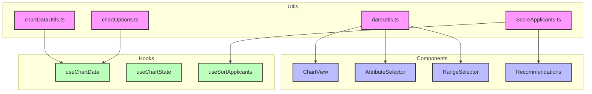
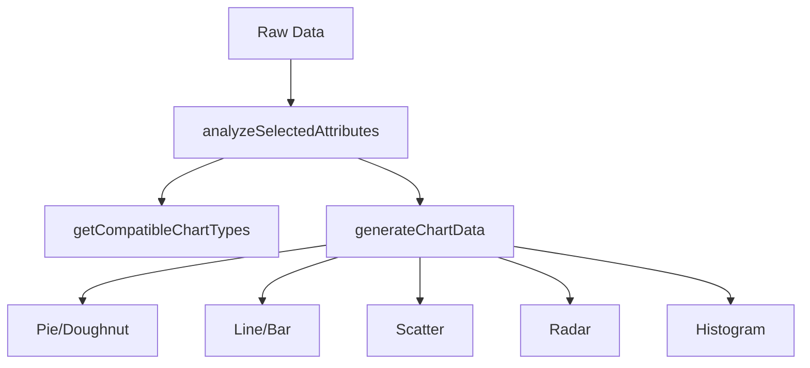
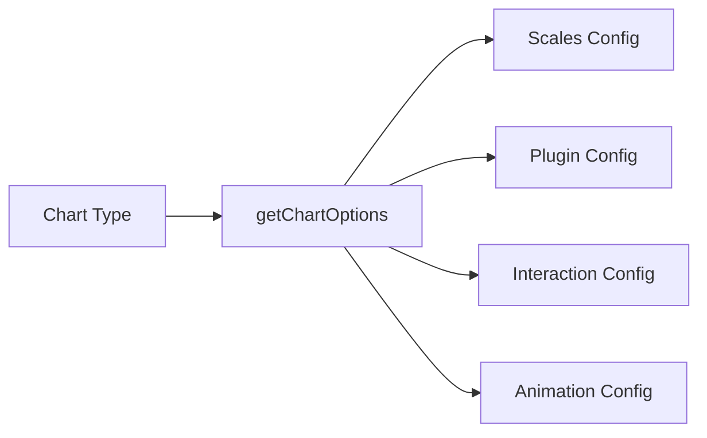
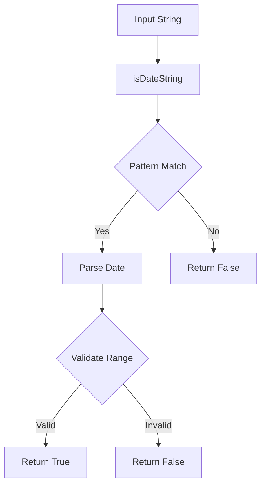
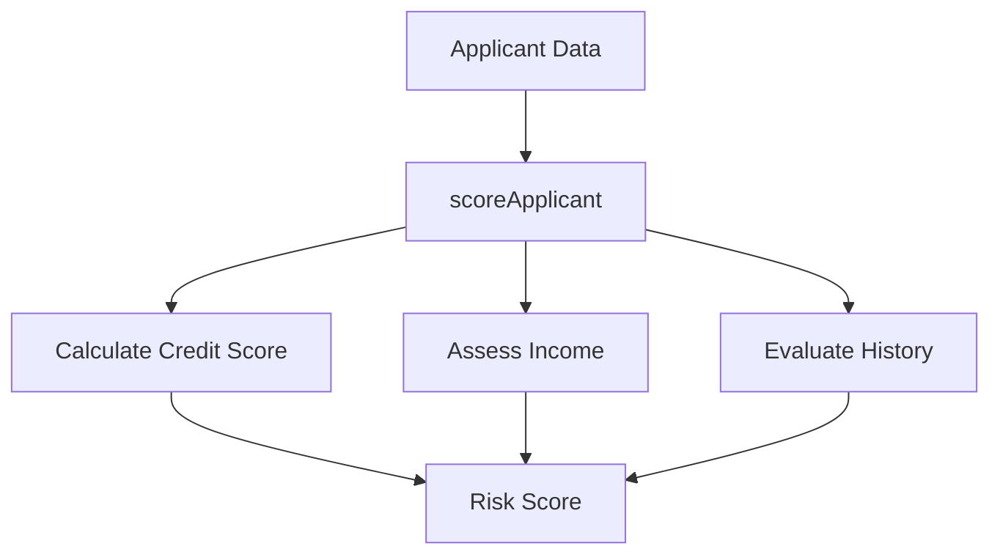
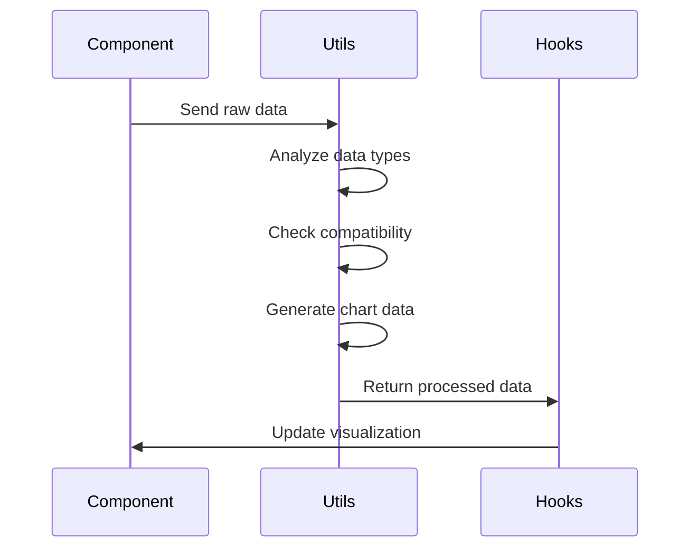
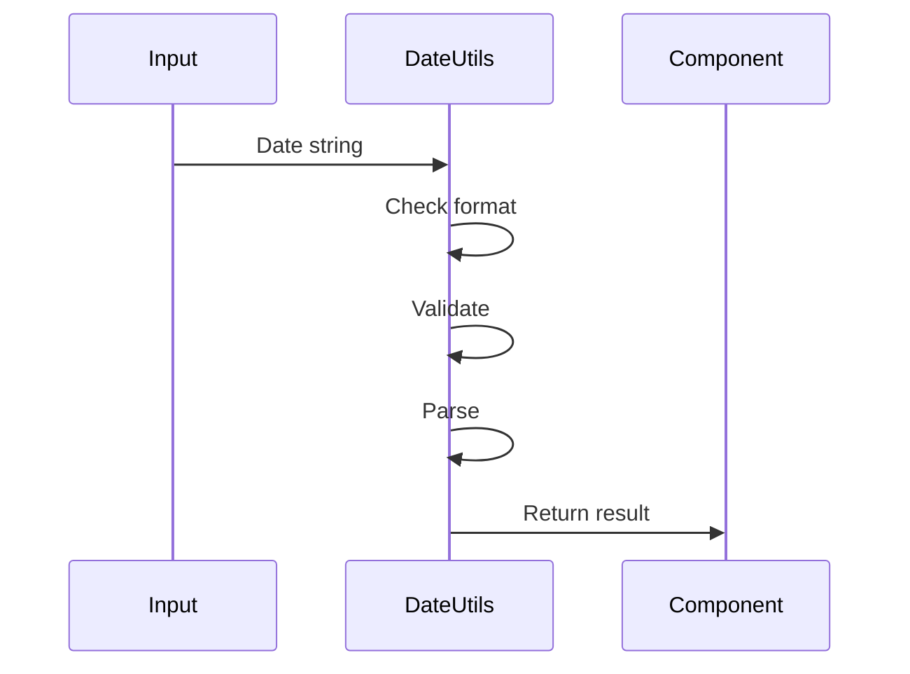

# Utility Functions Documentation

## 📊 Overview

The utils folder contains core utility functions that handle data processing, chart generation, date manipulation, and scoring algorithms. These utilities are used throughout the application to maintain consistent data handling and visualization logic.

## 🔄 File Structure and Dependencies



## 📝 Detailed File Descriptions

### 1. `chartDataUtils.ts`

Core functions for chart data processing and generation.



**Key Functions:**

- `analyzeSelectedAttributes`: Determines data types in selected columns
- `getCompatibleChartTypes`: Suggests suitable chart types based on data
- `generateCategoricalChartData`: Processes data for pie/doughnut charts
- `generateLineBarChartData`: Handles line and bar chart data
- `generateScatterChartData`: Prepares scatter plot data
- `generateRadarChartData`: Creates radar chart datasets
- `generateHistogramChartData`: Builds frequency distribution data

### 2. `chartOptions.ts`

Configurations for Chart.js visualizations.



**Features:**

- Responsive design options
- Zoom and pan configurations
- Custom tooltips and legends
- Axis formatting and scaling
- Animation settings

### 3. `dateUtils.ts`

Date parsing and validation utilities.



**Capabilities:**

- Multiple date format detection
- Date string validation
- Format conversion
- Range validation
- Supports formats:
  - DD/MM/YYYY
  - YYYY-MM-DD
  - MM/DD/YYYY
  - Text formats (e.g., "January 15, 2021")

### 4. `ScoreApplicants.ts`

Risk assessment and scoring algorithms.



**Scoring Factors:**

- Credit history analysis
- Income evaluation
- Loan type consideration
- Risk level determination

## 🔄 Integration Examples

### Chart Data Processing Flow:



### Date Processing Flow:



## 🔗 Dependencies

- **External Libraries:**
  - Chart.js
  - date-fns
  - lodash (for data manipulation)

## 🛠 Usage Guidelines

1. **Data Processing:**

   ```typescript
   import { analyzeSelectedAttributes } from "../utils/chartDataUtils";
   const { numeric, categorical } = analyzeSelectedAttributes(
     dataset,
     attributes
   );
   ```

2. **Date Validation:**

   ```typescript
   import { isDateString } from "../utils/dateUtils";
   const isValid = isDateString(dateValue);
   ```

3. **Chart Options:**

   ```typescript
   import { getChartOptions } from "../utils/chartOptions";
   const options = getChartOptions(chartType, config);
   ```

4. **Risk Scoring:**
   ```typescript
   import { scoreApplicant } from "../utils/ScoreApplicants";
   const riskScore = scoreApplicant(applicantData);
   ```

## 🔍 Debugging Tips

1. Check data types before processing
2. Verify date formats match expected patterns
3. Ensure chart data structure matches Chart.js requirements
4. Validate scoring inputs for completeness

## 🚀 Performance Considerations

- Use memoization for expensive calculations
- Implement throttling for real-time updates
- Consider data chunking for large datasets
- Cache processed results when possible
